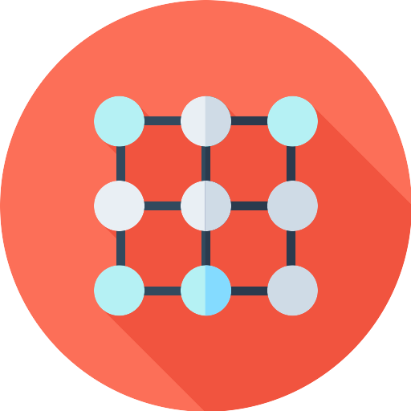

[](https://shields.io/)
[](https://shields.io/)
[](https://shields.io/)

<div align="center">
	<br>
	<br>
  	<a href="https://ubuntu.com">
		
	</a>	
	<h1>Neural Network CUDA Library</h1>
	<p>
    <b>Implementation of a basic neural network, functions and datasets using C++ and CUDA.</b>
	</p>
	<br>
	<br>
	<br>
</div>

## Resources

- [Introduction](#introduction)
- [Performances](#performances)
- [API Reference](#api_reference)

## Introduction <a id="introduction"></a>

### Summary 

### Architecture

### Challenges    

## Performances <a id="performances"></a>

### Device and host specifications

### Matrices

### Functions

### Datasets

### Neural networks

## API reference <a id="api_reference"></a>

- [Global](#api_reference_global)
- [Data structures](#api_reference_data_structures)
- [Functions](#api_reference_functions)
- [Models](#api_reference_models)
- [Util](#api_reference_util)

### Global <a id="api_reference_global"></a>

- To execute NVIDIA codes on GPU you must set the macro `lib/global.h/_USE_GPU`,
  otherwise the code will be executed on CPU (default `true`).
- To display debug logs, you must set the macro `lib/global.h/_DEBUG` (default `false`).
- To display error logs, you must set the macro `lib/global.h/_ERROR` (default `true`).
- To adapt the code to your GPU, you must set the value of the macro `lib/global.h/MAX_NB_THREADS_BLOCK`
  which is the maximal number of threads in a block (default `1024` corresponding to Nvidia RTX 6000).
 
### Data structures <a id="api_reference_data_structures"></a>

#### Class entry _([Source](https://github.com/emilienaufauvre/Neural-Network-CUDA-Library/blob/master/library/lib/data_structures/dataset/entry) · [Example](https://github.com/emilienaufauvre/Neural-Network-CUDA-Library/blob/master/library/examples/neural_network_1.cpp))_

Entry in a dataset.

- ```cpp 
  entry(matrix features, matrix labels);
  ```
- ```cpp 
  ~entry();
  ```
- ```cpp 
  const matrix &get_features() const;
  ```
- ```cpp 
  const matrix &get_labels() const;
  ```
- ```cpp 
  bool compare_features(const matrix &features) const;
  ```
- ```cpp 
  bool compare_labels(const matrix &labels) const;
  ```
- ```cpp 
  bool compare(const entry &e) const;
  ```
- ```cpp 
  bool operator!=(const entry &e) const;
  ```
- ```cpp 
  bool operator==(const entry &e) const;
  ```
- ```cpp 
  static void print(const entry &e);
  ```
  * Print the given entry.
  * **@param e** - the entry concerned.

#### Class dataset _([Source](https://github.com/emilienaufauvre/Neural-Network-CUDA-Library/blob/master/library/lib/data_structures/dataset/) · [Example](https://github.com/emilienaufauvre/Neural-Network-CUDA-Library/blob/master/library/examples/neural_network_1.cpp))_

Dataset representation.

- ```cpp 
  dataset();
  ```
- ```cpp 
  explicit dataset(std::vector<entry> &entries);
  ```
- ```cpp 
  ~dataset();
  ```
- ```cpp 
  void add(const matrix &features, const matrix &labels);
  ```
- ```cpp 
  void add(const entry &e);
  ```
- ```cpp 
  entry &get(size_t i);
  ```
- ```cpp 
  std::vector<entry> &get_entries();
  ```
- ```cpp 
  size_t size() const;
  ```
- ```cpp 
  std::pair<dataset, dataset> train_test_split(float train_size_ratio = 0.8f);
  ```
  * **@param** train_size_ratio - represent the proportion of the training dataset
    (between 0.f and 1.f).
  * **@return** - a partition of the dataset. The first part is for training,
    and the other for testing.
- ```cpp 
  dataset get_random_batch(size_t batch_size);
  ```
  * **@param** batch_size - the size of the batch.
  * **@return** - a random batch of the current dataset.
- ```cpp 
  static dataset load_mult();
  ```
  * Load the Multiplication Dataset
    For the "dataset::MULT_SIZE" entries, generate "dataset::MULT_N" random numbers
    in [0, "dataset::MULT_MAX"[ (the features), and associate them to the result
    of the multiplication between them (the label of size "dataset::MULT_NB_FEATURES").
- ```cpp 
  static dataset load_smallimg();
  ```
  * Load the Image Dataset
    For the "dataset::SMALLIMG_SIZE" entries, generate a random img
    of size "dataset::SMALLIMG_NB_FEATURES", and associate them to the
    labels of size "dataset::SMALLIMG_NB_LABELS".
- ```cpp 
  static void print(dataset &d);
  ```
  * Print the given dataset.
  * **@param d** - the dataset concerned.

#### Class matrix _([Source](https://github.com/emilienaufauvre/Neural-Network-CUDA-Library/blob/master/library/lib/data_structures/matrix/) · [Example](https://github.com/emilienaufauvre/Neural-Network-CUDA-Library/blob/master/library/examples/matrix.cpp))_

Matrix representation. Depending on the current configuration
either do computations on the host or the device.
A matrix of size N*M has N rows and M columns (row major).

- ```cpp 
  matrix() = default;
  ```
- ```cpp 
  matrix(const matrix &m);
  ```
- ```cpp 
  matrix(const matrix &m, std::string id);
  ```
- ```cpp 
  matrix(size_t x, size_t y);
  ```
- ```cpp 
  matrix(size_t x, size_t y, std::string id);
  ```
- ```cpp 
  explicit matrix(std::pair<size_t, size_t> dimensions);
  ```
- ```cpp 
  matrix(std::pair<size_t, size_t> dimensions, std::string id);
  ```
- ```cpp 
  matrix(std::initializer_list<float> values, size_t x, size_t y);
  ```
- ```cpp 
  matrix(std::initializer_list<float> values, size_t x, size_t y, std::string id);
  ```
- ```cpp 
  matrix(std::initializer_list<float> values, std::pair<size_t, size_t> dimensions);
  ```
- ```cpp 
  matrix(std::initializer_list<float> values, std::pair<size_t, size_t> dimensions, std::string id);
  ```
- ```cpp 
  matrix(const float *values, std::pair<size_t, size_t> dimensions);
  ```
- ```cpp 
  matrix(const float *values, std::pair<size_t, size_t> dimensions, std::string id);
  ```
- ```cpp 
  ~matrix();
  ```
- ```cpp 
  void set_id(const std::string &id);
  ```
- ```cpp 
  const std::string &get_id() const
  ```
- ```cpp 
  float *get_data() const;
  ```
- ```cpp 
  float *get_data()
  ```
- ```cpp 
  const std::pair<size_t, size_t> &get_dimensions() const; 
  ```
  * **@return** - the number of rows, and columns of the matrix.
- ```cpp 
  size_t get_length() const;
  ```
  * **@return** - the number of values in the matrix.
- ```cpp 
  matrix &operator=(const matrix &m);
  ```
- ```cpp 
  matrix &operator+=(const matrix &m);
  ```
- ```cpp 
  matrix operator+(const matrix &m);
  ```
- ```cpp 
  matrix &operator-=(const matrix &m);
  ```
- ```cpp 
  matrix operator-(const matrix &m);
  ```
- ```cpp 
  matrix &operator*=(const matrix &m);
  ```
- ```cpp 
  matrix operator*(const matrix &m);
  ```
- ```cpp 
  matrix &operator*=(float f);
  ```
- ```cpp 
  matrix operator*(float f);
  ```
- ```cpp 
  float &operator[](const int &i);
  ```
- ```cpp 
  const float &operator[](const int &i) const;
  ```
- ```cpp 
  bool operator==(const matrix &m) const;
  ```
- ```cpp 
  bool operator!=(const matrix &m) const;
  ```
- ```cpp 
  matrix hadamard_product(const matrix &v);
  ```
  * **@param v** - a vector of the same dimensions as the current matrix
  * **@return** - the Hadamard product between the current matrix and "v". 
- ```cpp 
  float sum() const;
  ```
  * **@return** - the sum of all the values in "_data". 
- ```cpp 
  matrix transpose() const;
  ```
  * **@return** - the transpose of the matrix.
- ```cpp 
  static void print(const matrix &m);
  ```
  * Print the given matrix (host memory).
  * **@param m** - the matrix concerned.

### Functions <a id="api_reference_functions"></a>

#### Class function _([Source](https://github.com/emilienaufauvre/Neural-Network-CUDA-Library/blob/master/library/lib/functions/) · [Example](https://github.com/emilienaufauvre/Neural-Network-CUDA-Library/blob/master/library/examples/activation_functions.cpp))_

Abstract wrapper to execute a function or its derivative on matrices.
The wrapped functions should be of the form "function_t", such that
the first matrix is the output (results), and the following the parameters.

- ```cpp 
  typedef void (*function_t)(std::vector<matrix *>);
  ```
- ```cpp 
  function(std::string id, function_t f, function_t df);
  ```
- ```cpp 
  matrix compute(std::vector<matrix *> inputs) const;
  ```
  * **@param inputs** - the matrices to be used for computation.
  * **@return** - the result of the function "_f" on "inputs".
- ```cpp 
  matrix compute_derivatives(std::vector<matrix *> inputs) const;
  ```
  * **@param inputs** - the matrices to be used for computation.
  * **@return** - the result of the derivative "_df" on "inputs".
- ```cpp
  std::string get_id() const;
  ```

#### Namespace activation_functions _([Source](https://github.com/emilienaufauvre/Neural-Network-CUDA-Library/blob/master/library/lib/functions/activation_functions) · [Example](https://github.com/emilienaufauvre/Neural-Network-CUDA-Library/blob/master/library/examples/activation_functions.cpp))_

Compute and return the outputs of the activation function for each
node in a layer.
Each cell of the inputted matrix contains the input of a node.
Inputs(i) corresponds to addition between the weighted sum of the previous
layer outputs, and the bias of the neuron "i".
(i.e. (x1 * wi1) + ... + (x2 * wi2) + bi).

- ```cpp
  function activation_functions::LINEAR;
  ```
- ```cpp
  function activation_functions::BINARY_STEP;
  ```
- ```cpp
  function activation_functions::SIGMOID;
  ```
- ```cpp
  function activation_functions::RELU;
  ```
- ```cpp
  function activation_functions::TANH;
  ```
- ```cpp
  function activation_functions::SOFTMAX;
  ```

#### Namespace loss_functions _([Source](https://github.com/emilienaufauvre/Neural-Network-CUDA-Library/blob/master/library/lib/functions/loss_functions) · [Example](https://github.com/emilienaufauvre/Neural-Network-CUDA-Library/blob/master/library/examples/loss_functions.cpp))_

Compute and return the error between two matrices;
"predictions" and "labels" (the ground truths).

- ```cpp
  function loss_functions::MEAN_SQUARED_ERROR;
  ```
  * For regression.
    Predictions which are far away from actual values are
    penalized heavily in comparison to less deviated predictions.
    Direction of the error is not considered.
- ```cpp
  function loss_functions::MEAN_ABSOLUTE_ERROR;
  ```
  * For regression.
    Predictions which are far away from actual values are
    penalized heavily in comparison to less deviated predictions.
    Direction of the error is not considered.
- ```cpp
  function loss_functions::MEAN_BIAS_ERROR;
  ```
  * For regression.
    Caution as positive and negative errors could cancel each other out.
    Direction of the error is considered.
- ```cpp
  function loss_functions::HINGE_LOSS;
  ```
  * For "maximum-margin" classification.
    Also named "SVM Loss" (used by SVM).
    Measure the performance of a classification model whose output
    is a probability value between 0 and 1.
    Increase as the predicted probability diverges from the actual label.
- ```cpp
  function loss_functions::BINARY_CROSS_ENTROPY;
  ```
  * For classification.
    Measure the performance of a classification model whose output
    is a probability value between 0 and 1.
    Increase as the predicted probability diverges from the actual label.
- ```cpp
  function loss_functions::CROSS_ENTROPY;
  ```
  * For classification.
    Measure the performance of a classification model whose output
    is a probability value between 0 and 1.
    Increase as the predicted probability diverges from the actual label.
  
### Models <a id="api_reference_models"></a>

#### Class layer

Layer of neurons, to be included in a neural network.

- ```cpp
  enum initializations
  {
    XAVIER,
    HE
  };
  ```
  * Layer weights type of initialization.
  * **@XAVIER** - for tanh activation.
  * **@HE** - for RELU activation.
- ```cpp
  layer(const size_t input_size, const size_t nb_neurons,
        initializations init = initializations::HE,
        const function &activation_function = activation_functions::LINEAR);
  ```
  * **@param input_size** - the size (number of columns) of the input.
  * **@param nb_neurons** - the total number of neurons in this layer.
  * **@param init** - the type of weight initialization.
  * **@param activation_function** - the function that compute the output of a neuron.
- ```cpp
  matrix feed_forward(matrix &inputs);
  ```
- ```cpp
  void backward_propagation(matrix &errors, layer *next);
  ```
- ```cpp
  void gradient_descent(size_t batch_size, float learning_rate);
  ```
- ```cpp
  std::string get_activation_function() const;
  ```
- ```cpp
  size_t size() const;
  ```
- ```cpp
  void print_neurons();
  ```
- ```cpp
  void print_weights();
  ```
- ```cpp
  void print_biases();
  ```
- ```cpp
  void print_errors();
  ```
- ```cpp
  static void print(const layer &l);
  ```
  * Print the given layer (activation function and size).
  * **@param l** - the layer concerned.

#### Class neural_network

Model implementation of a neural network.
Current implementation can be used with dataset
of 1 row features and 1 row labels.

- ```cpp
  neural_network(std::initializer_list<layer *> layers);
  ```
- ```cpp
  void fit(dataset &data,
           const function &loss_function,
           size_t epochs = 1,
           size_t batch_size = 1,
           float learning_rate = 0.01) override;
  ```
- ```cpp
  matrix predict(const matrix &features) const override;
  ```
- ```cpp
  std::vector<matrix> predict(dataset &test) const override;
  ```
- ```cpp
  layer *get_layer(int i);
  ```
- ```cpp
  static void print(const neural_network &n);
  ```
  * Print the given network (layers).
  * **@param n** - the network concerned.
  
### Namespace util <a id="api_reference_util"></a>

Utility functions (log, CUDA, etc.).

- ```cpp
  void CUDA_ASSERT(cudaError_t code, const char *file, int line, bool abort = true);
  ```
- ```cpp
  void INFO(const std::string &location, const std::string &message);
  ```
- ```cpp
  void DEBUG(const std::string &location, const std::string &message);
  ```
- ```cpp
  void ERROR(const std::string &location, const std::string &message);
  ```
- ```cpp
  void ERROR(const std::string &location, const std::string &message, cudaError_t err);
  ```
- ```cpp
  void ERROR_EXIT();
  ```
- ```cpp
  uint64_t ceil2(uint64_t n);
  ```
  * **@return** - the smallest integral power of two that is not smaller than "n".
- ```cpp
  std::pair<dim3, dim3> get_cuda_2dims(std::pair<size_t, size_t> dimensions);
  ```
  * **@param dimensions** - the pair <nb_rows, nb_cols> to map on a 2D CUDA grid.
  * **@return** - the CUDA block/thread configuration such that it
  * covers a grid of size "nb_rows" * "nb_cols".
- ```cpp
  std::pair<dim3, dim3> get_cuda_1dims(std::pair<size_t, size_t> dimensions);
  ```
  * **@param dimensions** - the pair <nb_rows, nb_cols> to map on a 1D CUDA grid.
  * **@return** - the CUDA block/thread configuration such that it
  * covers a grid of size "nb_rows" * "nb_cols".
- ```cpp
  void GPU_start_record(cudaEvent_t &start_event, cudaEvent_t &end_event);
  ```
  * Start the record of GPU execution time
  * **@param start_event** - the starting event. 
  * **@param end_event** - the ending event.
- ```cpp
  void GPU_end_record(float *time_event, cudaEvent_t &start_event, cudaEvent_t &end_event);
  ```
  * End the record of GPU execution time
  * **@param time_event** - the final execution time (ms).
  * **@param start_event** - the starting event. 
  * **@param end_event** - the ending event.
- ```cpp
  void CPU_start_record(float *time_event);
  ```
  * Start the record of CPU execution time
  * **@param end_event** - the start event.
- ```cpp
  void CPU_end_record(float *time_event);
  ```
  * End the record of CPU execution time
  * **@param end_event** - the end event (ms).